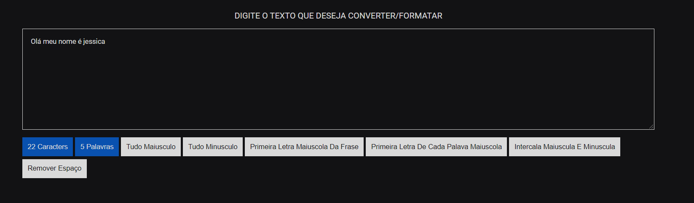

# Transform App

Transform app é um projeto desenvolvido com HTML, CSS e JS, com o objetivo de manipular/transformar strings/textos.

Você pode acessar a aplicação através do link [Transform](https://jessicamedeirosp.github.io/transform-app/).

A aplicação conta possui:
- Contador de caracteres 
- Contador de palavras
- Transformar texto em maiúsculo
- Transformar texto em minúsculo
- Transformar primeira letra da frase em maiúsculo
- Transformar primeira letra de cada palavra em maiúsculo
- Intercalar letras em maiúsculo e minúsculo
- Remover espaços de frases

